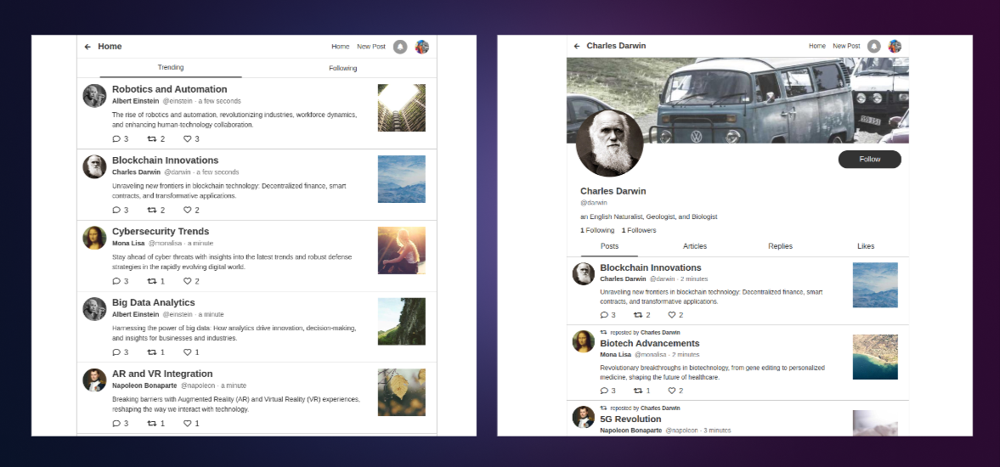

# Jots Protocol

[Jots](https://jots.social) is a fully decentralized social protocol powered by [WeaveDB](https://github.com/weavedb/weavedb) on [AO](https://ao.arweave.dev).



## Setting Up Localnet

### 1. AO Localnet

```bash
git clone -b hotfix https://github.com/weavedb/ao-localnet.git
```
Make sure you have NodeJS v22 installed and generate Arweave wallets.

```bash
cd ao-localnet/wallets && ./generateAll.sh
```

Execute the following docker command to run [SCAR](https://github.com/MichaelBuhler/scar) (Arweave Explorer) too.

```bash
cd ../ && sudo docker compose --profile explorer up
```

Now you should have the following nodes running on your local computer.

- ArLocal - [localhost:4000](http://localhost:4000)
- AOS MU - [localhost:4002](http://localhost:4002)
- AOS SU - [localhost:4003](http://localhost:4003)
- AOS CU - [localhost:4004](http://localhost:4004)
- SCAR - [localhost:4006](http://localhost:4006)

In another terminal, go to the `seed` directory, and download a WASM binary.

```bash
cd ao-localnet/seed && ./download-aos-module.sh
```

Grant tokens to the generated wallets.

```bash
./seed-for-aos.sh
```
At this point, you could run `aos`, but it's not necessary unless interacting with WeaveDB from AOS.

```bash
cd ../aos && yarn && ./aos
```
### 2. WeaveDB AO Units

Clone the `weavedb/cosmwasm-ao` repo, and install dependencies.

```bash
git clone https://github.com/weavedb/cosmwasm-ao.git
cd cosmwasm-ao && yarn
```

Create a `cwao.config.js` file.

```javascript
module.exports = {
  ao:{
    mu: "http://localhost:1992",
    su: "http://localhost:1993",
    cu: "http://localhost:1994",
    cus: { "http://localhost:1993": "http://localhost:1994" },
    arweave: { host: "localhost", port: 4000, protocol: "http" },
    graphql: "http://localhost:4000/graphql",
  }
}
```

Generate wallets.

```bash
yarn keygen admin -t ar && yarn addFund admin
yarn keygen scheduler -t ar && yarn addFund scheduler
yarn keygen bundler -t ar && yarn addFund bundler
yarn keygen rdk_admin
```

Start WeaveDB AO units.

```bash
yarn start admin
```

- WeaveDB MU - [localhost:1992](http://localhost:1992)
- WeaveDB SU - [localhost1993](http://localhost:1993)
- WeaveDB CU - [localhost:1994](http://localhost:1994)

In another terminal, add the WeaveDB module to AO.

```bash
yarn addModule admin

```
Set up the scheduler.

```bash
yarn setScheduler scheduler --url "http://localhost:1993"
```

Take notes of the `MODULE_ID` and the `SCHEDULER_ID` returned from these commands.

### 3. WeaveDB Rollup Node

Clone the `weavedb/rdk` repo, and install dependencies.

```bash
git clone https://github.com/weavedb/rdk.git && cd rdk
```

Run Envoy to establish GRPC communications between the web browser and the local node.

```bash
yarn envoy
```

In another terminal prepare to run the WeaveDB node.

```bash
cd node/node-server && yarn
```

Create a `weavedb.config.js` file.

Copy the `privateKey` of `rdk_admin` at `cosmwasm-ao/.weavedb/accounts/evm/rdk_admin.json` from the previous step to the `admin` field.

Copy the entire JSON object of `bundler` at `cosmwasm-ao/.weavedb/accounts/ar/bundler.json` from the previous step to the `bundler` field.

```javascript
module.exports = {
  dbname: "weavedb",
  admin: "0x...",
  bundler: { kty: "RSA", ... },
  rollups: {},
  ao:{
    mu: "http://localhost:1992",
    su: "http://localhost:1993",
    cu: "http://localhost:1994",
    arweave: { host: "localhost", port: 4000, protocol: "http" },
    graphql: "http://localhost:4000/graphql",
  }
}

```

Start the node.

```bash
node index.js
```

In another terminal, start the WeaveDB Explorer.

```bash
cd rdk/exproler && yarn && yarn dev --port 3001
```
Now the explorer is running at [localhost:3001/node/localhost](http://localhost:3001/node/localhost).

### 4. Setting up WeaveDB Instance

Clone the `weavedb/jots` repo, and install dependencies.

 ```bash
git clone https://github.com/weavedb/jots.git
cd jots/db && yarn
 ```

Generate necessary EVM wallets.

```bash
yarn keygen owner_l1
yarn keygen owner_l2
yarn keygen relayer
```

Create a `weavedb.config.js` file. Again, copy the `privateKey` from `rdk_admin`

```javascript
module.exports = {
  db: {
    app: "http://localhost:3000",
    name: "Jots",
    rollup: true,
    plugins: { notifications: {} },
    tick: 1000 * 60 * 5,
  },
  accounts: {
    evm: {
      admin: {
        privateKey:
          "0x...",
      },
    },
    ar: {},
  },
  defaultNetwork: "localhost",
  networks: {
    localhost: { url: "localhost:8080", admin: "admin" },
  },
}
```

Instantiate a WeaveDB instance for Jots.  
`owner_l1` is for L1 admin queries, and `owner_l2` is for L2 admin queries. We need 2 owners to avoid nonce collisions between L1 and L2.

```bash
yarn deploy jots \
--module MODULE_ID --scheduler SCHEDULER_ID --owner_l1 owner_l1 --owner_l2 owner_l2
```

Set up the Jots DB instance.

```bash
yarn setup jots --owner_l2 owner_l2 --relayer relayer
```

Initialize Jots with the genesis `user`.  
The genesis user will have 100 invites, that can be sent via the frontend dapp.

```bash
yarn initialize jots --owner_l2 owner_l2 --user USER_EVM_ADDRESS
```

### 5. Start Frontend Jots Dapp

```bash
cd jots/app && yarn && yarn dev
```

Now `Jots` is running at [localhost3000](http://localhost:3000).

### 6. Deploy zkJSON Solidity Contract on Ethereum Testnet

coming soon...
